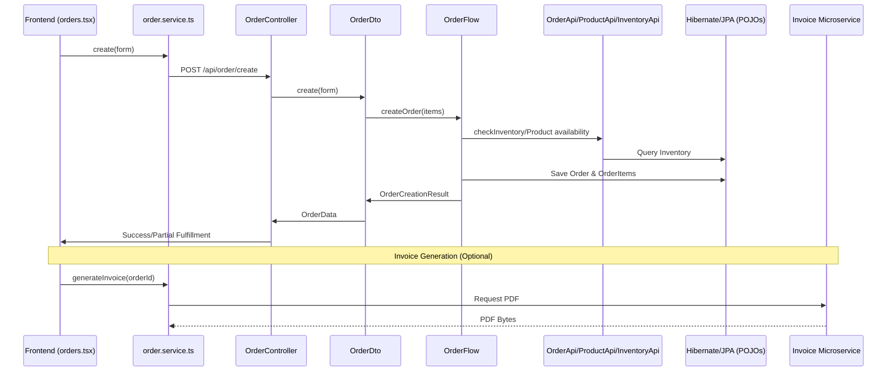
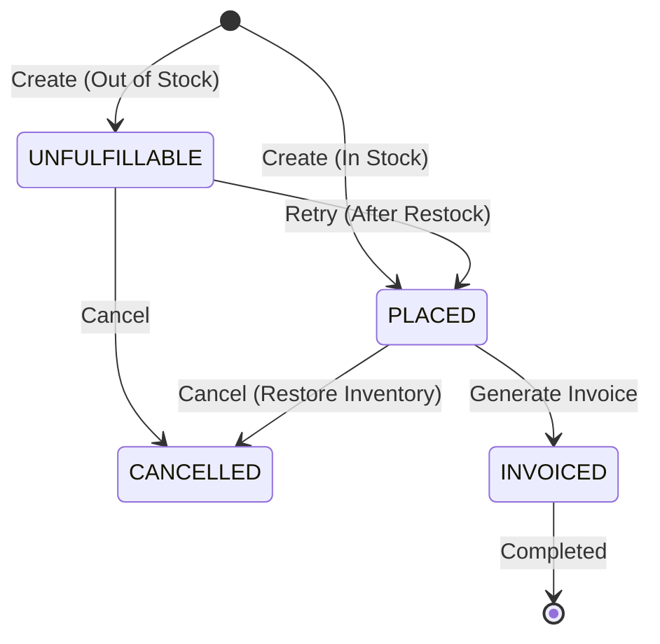

# Order Flow Architecture - Detailed Analysis

This document provides an in-depth explanation of the Order module in the POS system, covering the flow from the user interface to the database and external components.

## 1. High-Level Flow Overview

The order module follows a classic 3-tier architecture with an additional **Flow Layer** in the backend for complex orchestration.

---

## 2. Frontend Layer (pos-client)

### [orders.tsx](file:///Users/abhisheksudhir/Downloads/POS_v2/pos-client/src/pages/orders.tsx)
The main entry point for the Order UI.
- **Responsibilities**: 
  - Manages the state of the "active" order being created.
  - Handles client selection and product addition.
  - Communicates with `ProductService` to fetch MRP and check barcodes.
  - Displays different states of orders: `PLACED`, `INVOICED`, `CANCELLED`, `UNFULFILLABLE`.

### [order.service.ts](file:///Users/abhisheksudhir/Downloads/POS_v2/pos-client/src/services/order.service.ts)
- **Responsibilities**:
  - Acts as the API client using Axios.
  - Maps frontend types to REST endpoints.
  - Handles invoice downloading by creating a local Blob URL for the PDF bytes returned by the server.

---

## 3. Backend Layer (pos-server)

### [OrderController.java](file:///Users/abhisheksudhir/Downloads/POS_v2/pos-server/src/main/java/com/increff/pos/controller/OrderController.java)
- **Responsibilities**: Exposes REST endpoints (`/api/order`).
- **Endpoints**: `create`, `get-all-paginated`, `get-by-id`, `cancel`, `update`, `retry`.

### [OrderDto.java](file:///Users/abhisheksudhir/Downloads/POS_v2/pos-server/src/main/java/com/increff/pos/dto/OrderDto.java)
- **Responsibilities**: 
  - **Validation**: Ensures the request body (OrderForm) has at least one item, valid quantities, and non-negative MRPs.
  - **Conversion**: Uses `OrderHelper` to bridge the gap between `Pojo` (database models) and `Data` (API models).
  - **Coordination**: Calls `OrderFlow` for the actual business logic.

### [OrderFlow.java](file:///Users/abhisheksudhir/Downloads/POS_v2/pos-server/src/main/java/com/increff/pos/flow/OrderFlow.java)
This is the **heart of the order module**. Unlike simple CRUD, orders require atomic operations across multiple tables.
- **Key Methods**:
  - `createOrder`: 
    1. Generates a unique ID (e.g., `ORD-000001`).
    2. Runs `checkAllInventoryAvailable` (All-or-Nothing check).
    3. If available: Status = `PLACED`, reduces inventory quantities in one transaction.
    4. If not available: Status = `UNFULFILLABLE`, saves items but doesn't deduct stock.
  - `cancelOrder`: Restores inventory by adding back the quantities of all items in the order.
  - `updateOrder`: A "delete-and-recreate" style update where inventory is restored first, then the new list is processed.

---

## 4. External Integration & Invoicing

### [InvoiceDto.java](file:///Users/abhisheksudhir/Downloads/POS_v2/pos-server/src/main/java/com/increff/pos/dto/InvoiceDto.java)
- **Responsibilities**:
  - Orchestrates the connection with the separate `invoice-app`.
  - **PDF Generation**: Sends an `InvoiceRequest` (JSON) to the invoice microservice.
  - **Storage**: Receives PDF bytes and saves them to the local filesystem (defined by `invoice.storage.path`).
  - **Persistence**: Records the invoice metadata in the `pos-server` database.

### [InvoiceClientWrapper.java](file:///Users/abhisheksudhir/Downloads/POS_v2/pos-server/src/main/java/com/increff/pos/wrapper/InvoiceClientWrapper.java)
- Acts as a bridge to the external `invoice-app`.
- Encapsulates the HTTP logic for communicating with the PDF generation service.

---

## 5. Connections with Other Modules

| Module | Connection Type | Purpose |
| :--- | :--- | :--- |
| **Clients** | One-to-Many | Every order is linked to a Client. Frontend fetches clients for the dropdown. |
| **Products** | Many-to-Many (via OrderItem) | OrderItems contain a `productId`. Used to fetch Barcode, Name, and current MRP. |
| **Inventory** | Direct Dependency | `OrderFlow` must check/decrement inventory on creation and increment on cancellation. |
| **Audit Logs** | Event Tracking | Any status change (Create/Cancel/Invoice) is recorded in the Audit Log. |

## 6. Order State Machine

