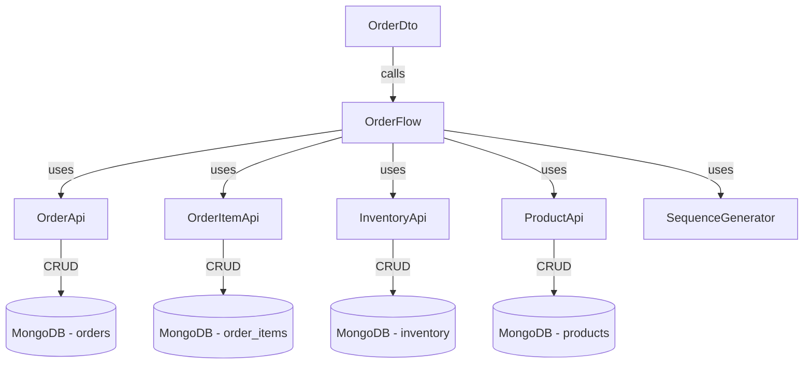

# OrderFlow - Complete In-Depth Explanation

## Table of Contents
1. [Overview](#overview)
2. [Architecture & Dependencies](#architecture--dependencies)
3. [Data Flow](#data-flow)
4. [Method-by-Method Deep Dive](#method-by-method-deep-dive)
5. [Your Specific Question: Why Set Barcode Again?](#your-specific-question-why-set-barcode-again)

---

## Overview

**OrderFlow** is the **orchestration layer** (also called the "Flow Layer") that coordinates multiple API services to handle complex order operations. It sits between the DTO layer (which handles HTTP requests) and the API layer (which handles individual entity operations).

### Purpose
- **Coordinate multi-step transactions** across multiple entities (Order, OrderItem, Inventory, Product)
- **Enforce business rules** (e.g., all-or-nothing inventory locking)
- **Maintain data consistency** with `@Transactional` boundaries
- **Handle complex workflows** that involve multiple database operations

---

## Architecture & Dependencies



### Injected Dependencies

```java
private final OrderApi orderApi;           // Manages Order documents
private final OrderItemApi orderItemApi;   // Manages OrderItem documents
private final InventoryApi inventoryApi;   // Manages Inventory documents
private final ProductApi productApi;       // Manages Product documents
private final SequenceGenerator sequenceGenerator; // Generates sequential order IDs
```

---

## Data Flow

### What Comes IN vs What Gets Stored

This is the KEY to understanding your question!

#### Input: `List<OrderItemPojo> orderItems`
When `createOrder()` is called, it receives a list of `OrderItemPojo` objects from the DTO layer. These objects contain:

```java
// What the FRONTEND sends (via OrderDto):
{
  "productId": "abc123",     // ✅ Set by frontend
  "quantity": 5,             // ✅ Set by frontend
  "mrp": 1299.0             // ✅ Set by frontend
  
  // What's MISSING (null/empty):
  "orderId": null,           // ❌ Not set yet
  "barcode": null,           // ❌ Not set yet
  "productName": null,       // ❌ Not set yet
  "lineTotal": 0.0          // ❌ Not calculated yet
}
```

#### Why These Fields Are Missing

1. **Frontend only knows**: `productId`, `quantity`, `mrp`
2. **Frontend doesn't know**:
   - `orderId` - hasn't been generated yet
   - `barcode` - stored in Product table, not sent by frontend
   - `productName` - stored in Product table, not sent by frontend
   - `lineTotal` - needs to be calculated server-side

---

## Method-by-Method Deep Dive

### 1. `createOrder(List<OrderItemPojo> orderItems)`

**Purpose**: Create a new order with inventory locking

**Transaction Boundary**: `@Transactional(rollbackFor = ApiException.class)`
- If ANY step fails, ALL changes are rolled back
- Ensures data consistency

#### Step-by-Step Breakdown

```java
@Transactional(rollbackFor = ApiException.class)
public OrderCreationResult createOrder(List<OrderItemPojo> orderItems) throws ApiException {
```

##### **STEP 1: Generate Order ID**
```java
long orderNumber = sequenceGenerator.getNextSequence("order");
String orderId = "ORD-" + String.format("%06d", orderNumber);
// Result: "ORD-000001", "ORD-000002", etc.
```

##### **STEP 2: Check Inventory Availability (All-or-Nothing)**
```java
InventoryCheckResult checkResult = checkAllInventoryAvailable(orderItems);
```

This method:
1. Loops through ALL items
2. For each item:
   - Gets the Product (to get barcode, name)
   - Gets the Inventory (to check available quantity)
   - If `availableQty < requestedQty`, adds to `unfulfillableItems` list
3. Returns result with:
   - `allAvailable` = true/false
   - `unfulfillableItems` = list of items that can't be fulfilled

##### **STEP 3A: If ALL Items Available → PLACED Order**

```java
if (checkResult.isAllAvailable()) {
    orderStatus = "PLACED";
    
    for (OrderItemPojo item : orderItems) {
        // 1. Validate product exists
        ProductPojo product = productApi.get(item.getProductId());
        
        // 2. Get inventory
        InventoryPojo inventory = inventoryApi.getByProductId(item.getProductId());
        
        // 3. LOCK INVENTORY (reduce quantity)
        int newQuantity = inventory.getQuantity() - item.getQuantity();
        inventoryApi.updateByProductId(item.getProductId(), newQuantity);
        
        // 4. ENRICH THE ORDER ITEM WITH MISSING DATA
        item.setOrderId(orderId);                    // Set the generated order ID
        item.setBarcode(product.getBarcode());       // Copy from Product table
        item.setProductName(product.getName());      // Copy from Product table
        item.setLineTotal(item.getQuantity() * item.getMrp()); // Calculate
        
        // 5. Save to database
        OrderItemPojo savedItem = orderItemApi.add(item);
        savedItems.add(savedItem);
        
        // 6. Update totals
        totalItems += item.getQuantity();
        totalAmount += item.getLineTotal();
    }
}
```

**Why We Set Barcode, ProductName, etc.:**

The `OrderItemPojo` that comes in from the frontend is **incomplete**. It only has:
- `productId` (reference to product)
- `quantity` (how many)
- `mrp` (price)

We need to **denormalize** the data by copying product details into the order item for these reasons:

1. **Performance**: When displaying orders, we don't want to join with Product table every time
2. **Historical Record**: If product name/barcode changes later, the order should show what it was at order time
3. **Data Integrity**: Order items should be self-contained records

##### **STEP 3B: If ANY Item Unavailable → UNFULFILLABLE Order**

```java
else {
    orderStatus = "UNFULFILLABLE";
    
    // Still save order items for tracking, but DON'T lock inventory
    for (OrderItemPojo item : orderItems) {
        ProductPojo product = productApi.get(item.getProductId());
        
        // Set order item details (NO inventory reduction)
        item.setOrderId(orderId);
        item.setBarcode(product.getBarcode());
        item.setProductName(product.getName());
        item.setLineTotal(item.getQuantity() * item.getMrp());
        
        OrderItemPojo savedItem = orderItemApi.add(item);
        savedItems.add(savedItem);
        
        totalItems += item.getQuantity();
        totalAmount += item.getLineTotal();
    }
}
```

**Key Difference**: NO inventory locking happens here!

##### **STEP 4: Create the Order Document**

```java
OrderPojo order = new OrderPojo();
order.setOrderId(orderId);
order.setStatus(orderStatus);          // "PLACED" or "UNFULFILLABLE"
order.setTotalItems(totalItems);
order.setTotalAmount(totalAmount);
order.setOrderDate(ZonedDateTime.now());

OrderPojo savedOrder = orderApi.add(order);
```

##### **STEP 5: Return Result**

```java
OrderCreationResult result = new OrderCreationResult();
result.setOrderId(savedOrder.getOrderId());
result.setFulfillable(checkResult.isAllAvailable());
result.setUnfulfillableItems(checkResult.getUnfulfillableItems());

return result;
```

---

### 2. `checkAllInventoryAvailable(List<OrderItemPojo> orderItems)`

**Purpose**: Pre-check if ALL items can be fulfilled (all-or-nothing logic)

```java
private InventoryCheckResult checkAllInventoryAvailable(List<OrderItemPojo> orderItems) {
    InventoryCheckResult result = new InventoryCheckResult();
    List<UnfulfillableItemData> unfulfillableItems = new ArrayList<>();
    
    for (OrderItemPojo item : orderItems) {
        // Get product details
        ProductPojo product = productApi.get(item.getProductId());
        
        // Check inventory
        InventoryPojo inventory = inventoryApi.getByProductId(item.getProductId());
        int availableQty = (inventory != null && inventory.getQuantity() != null) 
            ? inventory.getQuantity() : 0;
        
        if (availableQty < item.getQuantity()) {
            // This item is unfulfillable
            UnfulfillableItemData unfulfillable = new UnfulfillableItemData();
            unfulfillable.setBarcode(product.getBarcode());
            unfulfillable.setProductName(product.getName());
            unfulfillable.setRequestedQuantity(item.getQuantity());
            unfulfillable.setAvailableQuantity(availableQty);
            unfulfillable.setReason(availableQty == 0 ? "OUT_OF_STOCK" : "INSUFFICIENT_QUANTITY");
            unfulfillableItems.add(unfulfillable);
        }
    }
    
    result.setAllAvailable(unfulfillableItems.isEmpty());
    result.setUnfulfillableItems(unfulfillableItems);
    return result;
}
```

**Why This Exists**: 
- Prevents partial inventory locking
- If 3 items ordered but only 2 available, we don't lock ANY inventory
- All-or-nothing approach ensures consistency

---

### 3. `cancelOrder(String orderId)`

**Purpose**: Cancel a non-invoiced order and restore inventory

```java
@Transactional(rollbackFor = ApiException.class)
public OrderPojo cancelOrder(String orderId) throws ApiException {
    OrderPojo order = orderApi.getByOrderId(orderId);
    
    // Validation
    if ("INVOICED".equals(order.getStatus())) {
        throw new ApiException("Order is already invoiced and cannot be cancelled");
    }
    if ("CANCELLED".equals(order.getStatus())) {
        return order; // Idempotent - already cancelled
    }
    
    // Restore inventory for all order items
    List<OrderItemPojo> items = orderItemApi.getByOrderId(orderId);
    for (OrderItemPojo item : items) {
        // Get current inventory
        InventoryPojo inv = inventoryApi.getByProductId(item.getProductId());
        int currentQty = (inv != null && inv.getQuantity() != null) ? inv.getQuantity() : 0;
        
        // Add back the ordered quantity
        int newQty = currentQty + item.getQuantity();
        inventoryApi.updateByProductId(item.getProductId(), newQty);
    }
    
    // Mark order as cancelled
    OrderPojo patch = new OrderPojo();
    patch.setStatus("CANCELLED");
    return orderApi.update(order.getId(), patch);
}
```

**Key Points**:
- Only PLACED/UNFULFILLABLE orders can be cancelled
- INVOICED orders cannot be cancelled
- Inventory is restored (unlocked)
- Idempotent - calling twice doesn't cause issues

---

### 4. `updateOrder(String orderId, List<OrderItemPojo> newOrderItems)`

**Purpose**: Update a PLACED order with new items

**Flow**:
1. Validate order exists and status is PLACED
2. **Restore** inventory for all existing items
3. **Delete** all existing order items
4. **Validate** new items have sufficient inventory
5. **Lock** inventory for new items
6. **Save** new order items
7. **Update** order totals

```java
@Transactional(rollbackFor = ApiException.class)
public OrderPojo updateOrder(String orderId, List<OrderItemPojo> newOrderItems) {
    OrderPojo order = orderApi.getByOrderId(orderId);
    
    // Only PLACED orders can be edited
    if (!"PLACED".equals(order.getStatus())) {
        throw new ApiException("Only PLACED orders can be edited");
    }
    
    // Get existing items
    List<OrderItemPojo> existingItems = orderItemApi.getByOrderId(orderId);
    
    // Restore inventory for existing items
    for (OrderItemPojo item : existingItems) {
        InventoryPojo inv = inventoryApi.getByProductId(item.getProductId());
        int currentQty = (inv != null) ? inv.getQuantity() : 0;
        int restoredQty = currentQty + item.getQuantity();
        inventoryApi.updateByProductId(item.getProductId(), restoredQty);
    }
    
    // Delete existing items
    for (OrderItemPojo item : existingItems) {
        orderItemApi.delete(item.getId());
    }
    
    // Process new items (same as createOrder logic)
    int totalItems = 0;
    double totalAmount = 0.0;
    
    for (OrderItemPojo item : newOrderItems) {
        ProductPojo product = productApi.get(item.getProductId());
        InventoryPojo inventory = inventoryApi.getByProductId(item.getProductId());
        
        // Check inventory
        if (inventory == null || inventory.getQuantity() < item.getQuantity()) {
            throw new ApiException("Insufficient inventory for " + product.getName());
        }
        
        // Lock inventory
        int newQuantity = inventory.getQuantity() - item.getQuantity();
        inventoryApi.updateByProductId(item.getProductId(), newQuantity);
        
        // Enrich and save item
        item.setOrderId(orderId);
        item.setBarcode(product.getBarcode());
        item.setProductName(product.getName());
        item.setLineTotal(item.getQuantity() * item.getMrp());
        
        orderItemApi.add(item);
        
        totalItems += item.getQuantity();
        totalAmount += item.getLineTotal();
    }
    
    // Update order totals
    OrderPojo patch = new OrderPojo();
    patch.setTotalItems(totalItems);
    patch.setTotalAmount(totalAmount);
    return orderApi.update(order.getId(), patch);
}
```

---

### 5. `retryOrder(String orderId, List<OrderItemPojo> updatedItems)`

**Purpose**: Retry an UNFULFILLABLE order when inventory becomes available

**Two Scenarios**:

#### Scenario A: Retry with Same Items
```java
retryOrder("ORD-000005", null)
```
- Uses existing order items
- Re-checks inventory
- If available, locks inventory and changes status to PLACED

#### Scenario B: Retry with Updated Items
```java
retryOrder("ORD-000005", newItemsList)
```
- Deletes old items
- Uses new items
- Re-checks inventory
- If available, locks inventory and changes status to PLACED

**Flow**:
```java
@Transactional(rollbackFor = ApiException.class)
public OrderCreationResult retryOrder(String orderId, List<OrderItemPojo> updatedItems) {
    OrderPojo order = orderApi.getByOrderId(orderId);
    
    // Only UNFULFILLABLE orders can be retried
    if (!"UNFULFILLABLE".equals(order.getStatus())) {
        throw new ApiException("Only UNFULFILLABLE orders can be retried");
    }
    
    // Determine which items to check
    List<OrderItemPojo> itemsToCheck;
    if (updatedItems != null && !updatedItems.isEmpty()) {
        // Delete existing items
        List<OrderItemPojo> existingItems = orderItemApi.getByOrderId(orderId);
        for (OrderItemPojo existingItem : existingItems) {
            orderItemApi.delete(existingItem.getId());
        }
        itemsToCheck = updatedItems;
    } else {
        itemsToCheck = orderItemApi.getByOrderId(orderId);
    }
    
    // Check inventory
    InventoryCheckResult checkResult = checkAllInventoryAvailable(itemsToCheck);
    
    if (checkResult.isAllAvailable()) {
        // NOW available - lock inventory and change to PLACED
        for (OrderItemPojo item : itemsToCheck) {
            ProductPojo product = productApi.get(item.getProductId());
            InventoryPojo inventory = inventoryApi.getByProductId(item.getProductId());
            
            // Lock inventory
            int newQuantity = inventory.getQuantity() - item.getQuantity();
            inventoryApi.updateByProductId(item.getProductId(), newQuantity);
            
            // Save new items if needed
            if (item.getId() == null) {
                item.setOrderId(orderId);
                item.setBarcode(product.getBarcode());
                item.setProductName(product.getName());
                item.setLineTotal(item.getQuantity() * item.getMrp());
                orderItemApi.add(item);
            }
            
            totalItems += item.getQuantity();
            totalAmount += item.getLineTotal();
        }
        
        // Update order to PLACED
        OrderPojo patch = new OrderPojo();
        patch.setStatus("PLACED");
        patch.setTotalItems(totalItems);
        patch.setTotalAmount(totalAmount);
        orderApi.update(order.getId(), patch);
        
        return new OrderCreationResult(orderId, true, new ArrayList<>());
    } else {
        // Still unfulfillable
        return new OrderCreationResult(orderId, false, checkResult.getUnfulfillableItems());
    }
}
```

---

## Your Specific Question: Why Set Barcode Again?

### The Question
> "The argument is `List<OrderItemPojo> orderItems` which has barcode, quantity, mrp, lineTotal. So why are we setting barcode again with `item.setBarcode(product.getBarcode())`?"

### The Answer

**The input `OrderItemPojo` does NOT actually have the barcode set!**

Let me trace the data flow from frontend to backend:

#### 1. Frontend Sends (from `order.service.ts`):
```typescript
const form: CreateOrderForm = {
  lines: [
    {
      productId: "abc123",   // ✅ User selected product
      quantity: 5,           // ✅ User entered quantity
      mrp: 1299.0           // ✅ Fetched from product
    }
  ]
};
```

#### 2. OrderDto Receives (in `OrderDto.create()`):
```java
public OrderData create(OrderForm form) {
    List<OrderItemPojo> orderItems = new ArrayList<>();
    
    for (OrderLineForm line : form.getLines()) {
        OrderItemPojo item = OrderHelper.convertLineFormToEntity(line, null);
        // item now has: productId, quantity, mrp
        // item does NOT have: orderId, barcode, productName, lineTotal
        orderItems.add(item);
    }
    
    return orderFlow.createOrder(orderItems);
}
```

#### 3. OrderHelper.convertLineFormToEntity():
```java
public static OrderItemPojo convertLineFormToEntity(OrderLineForm form, String orderId) {
    OrderItemPojo pojo = new OrderItemPojo();
    pojo.setOrderId(orderId);           // null at creation time
    pojo.setProductId(form.getProductId()); // ✅ Set from frontend
    pojo.setQuantity(form.getQuantity());   // ✅ Set from frontend
    pojo.setMrp(form.getMrp());            // ✅ Set from frontend
    pojo.setLineTotal(form.getQuantity() * form.getMrp()); // ✅ Calculated
    return pojo;
    // NOTE: barcode and productName are NOT set here!
}
```

#### 4. OrderFlow Receives:
```java
// At this point, the OrderItemPojo has:
{
  "id": null,
  "orderId": null,           // ❌ Not set yet
  "productId": "abc123",     // ✅ From frontend
  "barcode": null,           // ❌ NOT SET!
  "productName": null,       // ❌ NOT SET!
  "quantity": 5,             // ✅ From frontend
  "mrp": 1299.0,            // ✅ From frontend
  "lineTotal": 6495.0       // ✅ Calculated
}
```

#### 5. OrderFlow Enriches:
```java
// Fetch product from database
ProductPojo product = productApi.get(item.getProductId());

// NOW we set the missing fields:
item.setOrderId(orderId);                    // Generated order ID
item.setBarcode(product.getBarcode());       // ← THIS IS WHY!
item.setProductName(product.getName());      // ← THIS IS WHY!
item.setLineTotal(item.getQuantity() * item.getMrp()); // Recalculate to be sure
```

### Why This Design?

**Data Denormalization for Performance & History**

1. **Performance**: When displaying orders, we don't need to join with Product table
2. **Historical Accuracy**: If product details change, order shows what it was at order time
3. **Data Integrity**: Order items are self-contained records

**Example**:
```
Day 1: Product "iPhone 15" has barcode "IP15-BLK-128"
Day 1: Order created → OrderItem stores barcode "IP15-BLK-128"
Day 5: Product barcode changed to "IP15-2024-BLK-128"
Day 10: View order → Still shows "IP15-BLK-128" (correct historical data)
```

---

## Summary

**OrderFlow** is the orchestration layer that:
1. **Coordinates** multiple APIs (Order, OrderItem, Inventory, Product)
2. **Enforces** business rules (all-or-nothing inventory locking)
3. **Enriches** incomplete data (adding barcode, productName from Product table)
4. **Maintains** transactional consistency with `@Transactional`
5. **Handles** complex workflows (create, update, cancel, retry)

The key insight is that **frontend sends minimal data** (productId, quantity, mrp), and **backend enriches it** with additional details (barcode, productName, orderId) before saving to the database.
