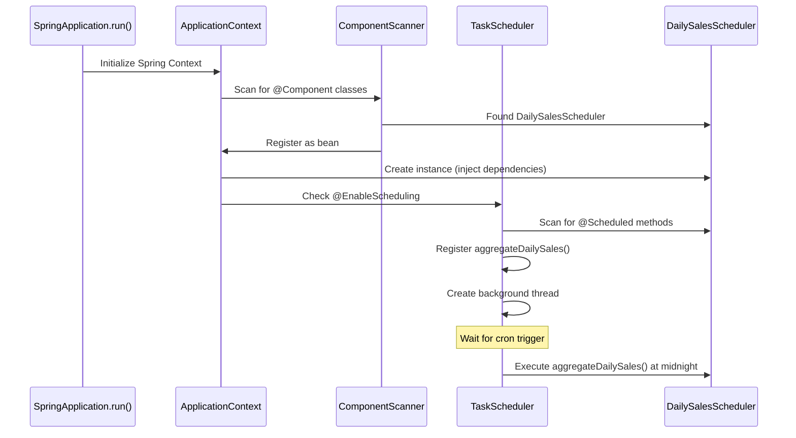

# Spring Scheduler - Complete In-Depth Explanation

## Quick Answer

**YES, the scheduler runs AUTOMATICALLY!** No manual triggering needed.

When you start the Spring Boot application, the scheduler:
1. ✅ Automatically detects `@Scheduled` methods
2. ✅ Automatically creates background threads
3. ✅ Automatically runs tasks at specified intervals
4. ✅ Continues running until application shuts down

---

## Table of Contents
1. [How Scheduling is Enabled](#how-scheduling-is-enabled)
2. [The DailySalesScheduler Class](#the-dailysalesscheduler-class)
3. [How Spring Detects and Runs Scheduled Tasks](#how-spring-detects-and-runs-scheduled-tasks)
4. [Cron Expression Explained](#cron-expression-explained)
5. [Complete Lifecycle](#complete-lifecycle)
6. [Testing and Debugging](#testing-and-debugging)

---

## How Scheduling is Enabled

### Step 1: Enable Scheduling in SpringConfig

**File**: `pos-server/src/main/java/com/increff/pos/config/SpringConfig.java`

```java
@SpringBootApplication
@ComponentScan(basePackages = { "com.increff.pos" })
@EnableScheduling  // ← THIS ENABLES SCHEDULING!
public class SpringConfig {
    public static void main(String[] args) {
        SpringApplication.run(SpringConfig.class, args);
    }
}
```

**What `@EnableScheduling` does**:
1. Activates Spring's scheduling infrastructure
2. Creates a `TaskScheduler` bean in the background
3. Scans all Spring beans for `@Scheduled` annotations
4. Registers scheduled tasks with the scheduler
5. Starts background threads to execute tasks

**Without `@EnableScheduling`**: 
- `@Scheduled` methods would be ignored
- No automatic execution would happen

---

## The DailySalesScheduler Class

**File**: `pos-server/src/main/java/com/increff/pos/scheduler/DailySalesScheduler.java`

```java
package com.increff.pos.scheduler;

import com.increff.pos.api.DailySalesApi;
import com.increff.pos.api.OrderApi;
import com.increff.pos.db.DailySalesPojo;
import com.increff.pos.db.OrderPojo;
import org.slf4j.Logger;
import org.slf4j.LoggerFactory;
import org.springframework.scheduling.annotation.Scheduled;
import org.springframework.stereotype.Component;

import java.time.LocalDate;
import java.time.ZonedDateTime;
import java.util.List;

@Component  // ← Makes this a Spring bean
public class DailySalesScheduler {
    
    private static final Logger logger = LoggerFactory.getLogger(DailySalesScheduler.class);
    
    private final OrderApi orderApi;
    private final DailySalesApi dailySalesApi;
    
    // Constructor injection
    public DailySalesScheduler(OrderApi orderApi, DailySalesApi dailySalesApi) {
        this.orderApi = orderApi;
        this.dailySalesApi = dailySalesApi;
    }
    
    /**
     * Runs every day at midnight (00:00:00)
     * Aggregates previous day's sales data
     */
    @Scheduled(cron = "0 0 0 * * *")  // ← THIS TRIGGERS AUTOMATIC EXECUTION!
    public void aggregateDailySales() {
        try {
            logger.info("Starting daily sales aggregation...");
            
            // Get yesterday's date
            LocalDate yesterday = LocalDate.now().minusDays(1);
            
            // Get start and end of yesterday
            ZonedDateTime startOfDay = yesterday.atStartOfDay(java.time.ZoneId.systemDefault());
            ZonedDateTime endOfDay = yesterday.plusDays(1).atStartOfDay(java.time.ZoneId.systemDefault());
            
            // Get all orders from yesterday
            List<OrderPojo> orders = orderApi.getWithFilters(null, null, startOfDay, endOfDay);
            
            // Calculate totals
            int totalOrders = orders.size();
            int invoicedOrders = 0;
            double totalRevenue = 0.0;
            int totalItemsSold = 0;
            
            for (OrderPojo order : orders) {
                if ("INVOICED".equals(order.getStatus())) {
                    invoicedOrders++;
                    totalRevenue += order.getTotalAmount();
                    totalItemsSold += order.getTotalItems();
                }
            }
            
            // Create daily sales record
            DailySalesPojo dailySales = new DailySalesPojo();
            dailySales.setDate(yesterday);
            dailySales.setTotalOrders(totalOrders);
            dailySales.setInvoicedOrders(invoicedOrders);
            dailySales.setTotalRevenue(totalRevenue);
            dailySales.setTotalItemsSold(totalItemsSold);
            
            // Save to database
            dailySalesApi.upsert(dailySales);
            
            logger.info("Daily sales aggregation completed for {}: {} orders, {} invoiced, revenue: {}",
                    yesterday, totalOrders, invoicedOrders, totalRevenue);
                    
        } catch (Exception e) {
            logger.error("Error during daily sales aggregation", e);
        }
    }
}
```

### Key Annotations

#### `@Component`
```java
@Component
public class DailySalesScheduler {
```
- Makes this class a **Spring bean**
- Spring automatically creates an instance during application startup
- Enables dependency injection (OrderApi, DailySalesApi)

#### `@Scheduled`
```java
@Scheduled(cron = "0 0 0 * * *")
public void aggregateDailySales() {
```
- Marks this method for automatic scheduled execution
- Spring's scheduler will call this method automatically
- No manual invocation needed!

---

## How Spring Detects and Runs Scheduled Tasks

### Application Startup Sequence



### Detailed Steps

#### 1. **Application Starts**
```java
SpringApplication.run(SpringConfig.class, args);
```

#### 2. **Spring Scans for Components**
- Finds `@Component` classes in `com.increff.pos` package
- Discovers `DailySalesScheduler`

#### 3. **Spring Creates Bean**
```java
// Spring automatically does this:
OrderApi orderApi = applicationContext.getBean(OrderApi.class);
DailySalesApi dailySalesApi = applicationContext.getBean(DailySalesApi.class);
DailySalesScheduler scheduler = new DailySalesScheduler(orderApi, dailySalesApi);
```

#### 4. **Scheduling Infrastructure Activates**
Because of `@EnableScheduling`, Spring:
1. Creates a `TaskScheduler` bean
2. Scans all beans for `@Scheduled` methods
3. Finds `aggregateDailySales()` method
4. Parses the cron expression: `"0 0 0 * * *"`
5. Registers the task with the scheduler

#### 5. **Background Thread Created**
```java
// Spring internally does something like:
ScheduledExecutorService executor = Executors.newScheduledThreadPool(1);
executor.schedule(() -> {
    dailySalesScheduler.aggregateDailySales();
}, calculateDelayUntilMidnight(), TimeUnit.MILLISECONDS);
```

#### 6. **Task Executes Automatically**
- At midnight (00:00:00), the scheduler wakes up
- Calls `aggregateDailySales()` method
- Method executes in background thread
- After completion, scheduler calculates next midnight
- Schedules next execution

---

## Cron Expression Explained

### The Expression: `"0 0 0 * * *"`

```
┌───────────── second (0-59)
│ ┌───────────── minute (0-59)
│ │ ┌───────────── hour (0-23)
│ │ │ ┌───────────── day of month (1-31)
│ │ │ │ ┌───────────── month (1-12)
│ │ │ │ │ ┌───────────── day of week (0-7) (0 and 7 are Sunday)
│ │ │ │ │ │
│ │ │ │ │ │
0 0 0 * * *
```

**Breakdown**:
- `0` - At 0 seconds
- `0` - At 0 minutes
- `0` - At 0 hours (midnight)
- `*` - Every day of the month
- `*` - Every month
- `*` - Every day of the week

**Result**: Runs at **00:00:00 every day**

### Other Common Cron Examples

```java
// Every 5 minutes
@Scheduled(cron = "0 */5 * * * *")

// Every hour at minute 30
@Scheduled(cron = "0 30 * * * *")

// Every day at 2:30 AM
@Scheduled(cron = "0 30 2 * * *")

// Every Monday at 9:00 AM
@Scheduled(cron = "0 0 9 * * MON")

// First day of every month at midnight
@Scheduled(cron = "0 0 0 1 * *")
```

### Alternative: Fixed Rate/Delay

Instead of cron, you can use:

```java
// Run every 24 hours (86400000 milliseconds)
@Scheduled(fixedRate = 86400000)
public void aggregateDailySales() {
    // ...
}

// Run 24 hours after previous execution completes
@Scheduled(fixedDelay = 86400000)
public void aggregateDailySales() {
    // ...
}

// Run with initial delay
@Scheduled(initialDelay = 5000, fixedRate = 86400000)
public void aggregateDailySales() {
    // ...
}
```

---

## Complete Lifecycle

### Timeline of Events

```
TIME          EVENT
━━━━━━━━━━━━━━━━━━━━━━━━━━━━━━━━━━━━━━━━━━━━━━━━━━━━━━━━━━━━━━━━━━━━━━━━━━━━
00:00:00      Application starts
              ├─ Spring scans for @Component
              ├─ Creates DailySalesScheduler bean
              ├─ Detects @Scheduled method
              ├─ Calculates next midnight (tomorrow 00:00:00)
              └─ Schedules task

00:00:01      Application fully started
              └─ Scheduler running in background

...           (Application running normally)

23:59:59      (Next day approaching)

00:00:00      ⏰ SCHEDULER TRIGGERS!
              ├─ Calls aggregateDailySales()
              ├─ Aggregates yesterday's sales
              ├─ Saves to database
              ├─ Logs completion
              ├─ Calculates next midnight
              └─ Schedules next execution

00:00:05      Task completed
              └─ Waiting for next midnight

...           (Repeat daily)
```

### What Happens at Midnight

```java
// 1. Scheduler wakes up
logger.info("Starting daily sales aggregation...");

// 2. Calculate yesterday's date range
LocalDate yesterday = LocalDate.now().minusDays(1);  // 2026-01-28
ZonedDateTime startOfDay = yesterday.atStartOfDay(); // 2026-01-28T00:00:00
ZonedDateTime endOfDay = yesterday.plusDays(1).atStartOfDay(); // 2026-01-29T00:00:00

// 3. Query orders from yesterday
List<OrderPojo> orders = orderApi.getWithFilters(null, null, startOfDay, endOfDay);

// 4. Calculate aggregates
int totalOrders = orders.size();
int invoicedOrders = 0;
double totalRevenue = 0.0;
int totalItemsSold = 0;

for (OrderPojo order : orders) {
    if ("INVOICED".equals(order.getStatus())) {
        invoicedOrders++;
        totalRevenue += order.getTotalAmount();
        totalItemsSold += order.getTotalItems();
    }
}

// 5. Create daily sales record
DailySalesPojo dailySales = new DailySalesPojo();
dailySales.setDate(yesterday);
dailySales.setTotalOrders(totalOrders);
dailySales.setInvoicedOrders(invoicedOrders);
dailySales.setTotalRevenue(totalRevenue);
dailySales.setTotalItemsSold(totalItemsSold);

// 6. Save to MongoDB
dailySalesApi.upsert(dailySales);

logger.info("Daily sales aggregation completed for {}: {} orders, {} invoiced, revenue: {}",
        yesterday, totalOrders, invoicedOrders, totalRevenue);
```

---

## Testing and Debugging

### 1. **Manual Trigger (for testing)**

You can create a controller endpoint to manually trigger the scheduler:

```java
@RestController
@RequestMapping("/api/scheduler")
public class SchedulerController {
    
    private final DailySalesScheduler scheduler;
    
    public SchedulerController(DailySalesScheduler scheduler) {
        this.scheduler = scheduler;
    }
    
    @PostMapping("/trigger-daily-sales")
    public String triggerDailySales() {
        scheduler.aggregateDailySales();
        return "Daily sales aggregation triggered manually";
    }
}
```

### 2. **Change Cron for Testing**

For testing, change to run every minute:

```java
// Original: runs at midnight
@Scheduled(cron = "0 0 0 * * *")

// Testing: runs every minute
@Scheduled(cron = "0 * * * * *")

// Testing: runs every 10 seconds
@Scheduled(cron = "*/10 * * * * *")
```

### 3. **Check Logs**

The scheduler logs its activity:

```
2026-01-29 00:00:00 INFO  DailySalesScheduler - Starting daily sales aggregation...
2026-01-29 00:00:02 INFO  DailySalesScheduler - Daily sales aggregation completed for 2026-01-28: 7 orders, 5 invoiced, revenue: 105393.0
```

### 4. **Verify in Database**

Check MongoDB:

```javascript
db.daily_sales.find().sort({date: -1}).limit(5)
```

---

## Important Notes

### 1. **No Manual Triggering Needed**
- Scheduler runs **automatically** when application starts
- No need to call the method manually
- No need to create a separate thread

### 2. **Runs in Background**
- Doesn't block application startup
- Doesn't interfere with API requests
- Runs in separate thread pool

### 3. **Survives Application Restarts**
- When application restarts, scheduler restarts
- Previous schedule is lost (not persisted)
- Next execution calculated from current time

### 4. **Exception Handling**
```java
try {
    // Aggregation logic
} catch (Exception e) {
    logger.error("Error during daily sales aggregation", e);
    // Scheduler continues running even if one execution fails
}
```

### 5. **Thread Safety**
- Each execution runs in its own thread
- If previous execution is still running, next one may be delayed
- Use `@Scheduled(fixedDelay = ...)` to wait for completion

---

## Summary

**How Scheduler is Activated**:

1. ✅ **`@EnableScheduling`** in SpringConfig enables scheduling
2. ✅ **`@Component`** makes DailySalesScheduler a Spring bean
3. ✅ **`@Scheduled`** marks method for automatic execution
4. ✅ **Spring automatically**:
   - Detects the scheduled method
   - Creates background threads
   - Executes at specified times
   - Continues until application shuts down

**No manual triggering needed!** Just start the application and the scheduler runs automatically. 🚀
